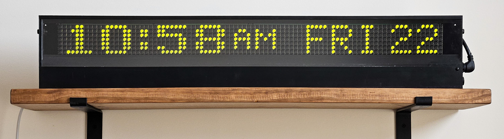

# dotclock


Command-line tool to show a clock on a Luminator display, written in Rust.



At the moment, it's really only *my* Luminator display (a MAX3000 90 × 7 side sign), but it would be relatively easy to extend to different types of signs. If nothing else, it's a good example of how to use my [flipdot](https://github.com/alusch/flipdot) and [flipdot-graphics](https://github.com/alusch/flipdot-graphics) crates to do something useful.

## Usage

The most common "real-world" usage is

```
./dotclock /dev/ttyUSB0 --address 3
```

which will attempt communication with an actual sign with address 3 over the specified serial port. You can specify a few options to control the appearance:
* `-t` or `--24hour` to display a 24-hour representation (14:30) instead of the default 12-hour (2:30 PM)
* `-d` or `--dayofweek` to show the day of the week (e.g. WED 28) after the time instead of the month (FEB 28)

By default it will run indefinitely and use a timer to update every minute, but the `-o` or `--oneshot` option will display the time once and exit, suitable for use in a `cron` job.

For testing purposes, you can pass `virtual` as the port name to fake communication with a virtual sign instead. This doesn't actually print anything to the console without enabling the `RUST_LOG` environment variable. Example:

```
RUST_LOG=flipdot=info ./dotclock virtual -a 3
```

## License

Distributed under the [MIT license](/LICENSE).

Note: Depends on the [`timer`](https://github.com/Yoric/timer.rs) crate, which is licensed under MPL 2.0.
